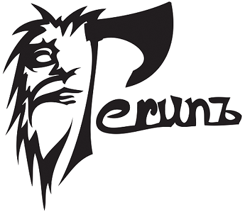

Perun: Lightweight Performance Version System
=============================================

  

Perun is an open source light-weight Performance Version System, which 
which works as a wrapper over existing Version Control Systems and manages 
performance profiles for different versions of projects. Moreover,
it offers a tool suite allowing one to automate the performance
regression test runs, postprocess existing profiles or interpret the
results. 

  

In particular, it has the following advantages over using 
databases or sole Version Control Systems:

  1.  **Preserves Context**---each performance profile is assigned to a concrete
      minor version adding the missing context to your profiles.
      
  2.  **Provides Automation**---Perun allows one to easily automate the process
      of profile collection, eventually reducing the whole process to a
      single command. The specification of jobs is designed as YAML file.
      
  3.  **Is Highly Generic**---supported format of the performance profiles is
      based on [JSON](https://www.json.org/) notation. Perun tool suite 
      contains a basic set of visualizations, postprocessing and 
      collection modules. Its tool suite is easily extensible.
      
  4.  **Is Easy to use**---the workflow, interface and storage of Perun is
      heavily inspired by the git systems aiming at natural use. 

  

Perun can be used in two ways: (1) for a single developer (or a small team) as a complete
solution for automating, storing and interpreting performance of ones project or (2) as a dedicated
store for a bigger projects and teams. Its git-like design aims at easy distribution and simple
interface makes it a simple store of profiles along with the context.

Installation
------------

You can install Perun as follows:

    git clone https://github.com/tfiedor/perun.git
    cd perun
    make init
    make install

These commands installs Perun to your system as a python package. You can then run perun safely from
the command line using the `perun` command. Run either `perun --help` or see the cli documentation
for more information about running Perun commands from command line. Note that depending on your OS
and the location of Python libraries, you might require root permissions to install Perun.

It is advised to verify that Perun is running correctly in your environment as follows:

    make test

Developing
----------

Alternatively you can install Perun in development mode:

    git clone https://github.com/tfiedor/perun.git
    cd perun
    make init
    make dev

This method of installation allows you to make a changes to the code, which will be then reflected
by the installation.

It is advised to verify that Perun is running correctly in your environment as follows:

    make test
    
If you are interested in contributing to Perun project, please refer to
[contributing](CONTRIBUTING) section. If you think your results could help others, please [send us
PR](https://github.com/tfiedor/perun/pull/new/develop), we will review the code and in case it is
suitable for wider audience, we will include it in our [upstream](https://github.com/tfiedor/perun).

But, please be understanding, we cannot fix and merge everything.

Getting Started
---------------
In order to start managing performance of your project, go to its directory and run the following:

    perun init --vcs-type=git --configure
    
This creates a parallel directory structure for Perun storage, and runs the initial configuration 
of the local project settings. Here you can chose the set of collectors, postprocessors and specify
which commands (and with which configurations) should be profiled.

Now start collecting the profiles for current version of project:

    perun run matrix
    
You can then view the list of collected and registered profiles, and visualize the profiles, or 
check for possible performance changes:

    # Show list of profiles
    perun status
    
    # Show the first generated profile using scatter plot
    perun show 0@p scatter -v
    
    # Register the first generated profile to current minor version
    perun add 0@p
    
Now one can do some changes, commit them, rerun the collection phase, register new profiles and 
check whether any change in performance can be detected:

    # Rerun the collection
    perun run matrix
    
    # Register the profiles for current minor version
    perun add 0@p
    
    # Run the degradation check
    perun check head

Features
--------

In the following, we list the foremost features and advantages of Perun:

  -   **Unified format**---we base our format of performance profiles on
  [JSON](https://www.json.org/).
  
  -   **Natural specification of Profiling Runs**---we base the
      specification of profiling jobs in [Yaml](http://yaml.org/)
      format. 
      
  -   **Git-inspired Interface**---the cli is inspired by git version
      control systems and specifies commands like e.g. `add`, `remove`,
      `status`, or `log`.
      
  -   **Efficient storage**---performance profiles are stored compressed
      in the storage in parallel to versions of the profiled project.
      
  -   **Multiplatform-support**---Perun is implemented in Python 3 and
      its implementation is supported both by Windows and Unix-like
      platforms. 
      
  -   **Regression Analysis**---Perun's suite contains a postprocessing
      module for regression analysis of profiles, which supports
      several different strategies for finding the best predicting model for given
      data (such as linear, quadratic, or constant model).
      
  -   **Interactive Visualizations**---Perun's tool suite includes
      several visualization modules, some of them based on
      [Bokeh](https://bokeh.pydata.org/en/latest/) visualization
      library, which provides nice and interactive plots, in exchange of
      scalability.
      
  -   **Useful API for profile manipulation**---helper modules are
      provided for working with our profiles in external applications
      ---we have API for executing simple queries over the resources 
      or other parts of the profiles, or convert and transform the 
      profiles to different representations (e.g. pandas data frame). 
      
  -   **Automatic Detection of Performance Degradation**---we are
      currently exploring effective heuristics for automatic detection
      of performance degradation between two project versions (e.g.
      between two commits)

As a sneak peek, we are currently working and exploring the following featurues in near future of
the project:

  -   **Regular Expression Driven Collector**---collector based on 
      parsing the standard text output for a custom specified metrics, 
      specified by regular expressions. 
      
  -   **Fuzzing Collector**---collector based on method of fuzz testing
      ---i.e. modifying inputs in order to force error or, in our case, 
      a performance change. 
      
  -   **Clustering Postprocessor**---we are exploring now how to make
      any profile usable for regression analysis. 
      
  -   **Automatic Hooks**---the automatic hooks,
      that will allow to automate the runs of job matrix, automatic
      detection of degradation and efficient storage. 
      
For more information about Perun's feature, please refer to our documentation!

Contributing
------------

If you'd like to contribute, please fork the repository and use a feature branch. Pull requests are
warmly welcome.

In case you run in some unexpected behaviour, error or anything suspicious, either contact us
directly through mail or [create a new Issue](https://github.com/tfiedor/perun/issues/new).

The architecture of Perun allows easy extension. In case you are interested in extending our tool 
suite with new kinds of collectors, postprocessors or visualization methods, please refer
to appropriate sections in Perun's documentation.

If you are interested in contributing to Perun project, please first refer to
[contributing](Contributing.md) section. If you think your custom module could help others, please
[send us PR](https://github.com/tfiedor/perun/pull/new/develop), we will review the code and in case
it is suitable for wider audience, we will include it in our
[upstream](https://github.com/tfiedor/perun).

But, please be understanding, we cannot fix and merge everything.

Links
-----

   -   Project repository : <https://github.com/tfiedor/perun>
   -   Issue tracker: <https://github.com/tfiedor/perun/issues>
       - In case of sensitive bugs like security vulnerabilities, please contact
       :   <TomasFiedor@gmail.com> directly instead of using issue tracker. We
           value your effort to improve the security and privacy of
           this project!
   -   Project documentation:
       - Online: <https://tfiedor.github.io/perun/>
       - Latest Typeset: <https://github.com/tfiedor/perun/blob/master/docs/pdf/perun.pdf>
     
Unrelated links:

   -   Check out our research group focusing on program analysis, static and dynamic analysis,
   formal methods, verification and many more:
   <http://www.fit.vutbr.cz/research/groups/verifit/index.php.en>

Licensing
---------

The code in this project is licensed under GNU GPLv3 license.

Acknowledgements
----------------

We thank for the support received from [Red Hat](https://www.redhat.com/en/global/czech-republic)
(especially branch of Brno), Brno University of Technology ([BUT FIT](https://www.fit.vutbr.cz/))
and H2020 ECSEL project [Aquas](https://aquas-project.eu/).

Further we would like to thank the following individuals (in the
alphabetic order) for their (sometimes even just a little)
contributions:

  -   **Jan Fiedor** (Honeywell)---for feedback, and technical
      discussions;
  -   **Martin Hruska** (BUT FIT)---for feedback, and technical
      discussions;
  -   **Petr Müller** (SAP)---for nice discussion about the project;
  -   **Michal Kotoun** (BUT FIT)---for feedback, and having faith in
      this repo;
  -   **Hanka Pluhackova** (BUT FIT)---for awesome logo, theoretical
      discussions about statistics, feedback, and lots of ideas;
  -   **Adam Rogalewicz** (BUT FIT)---for support, theoretical
      discussions, feedback;
  -   **Tomas Vojnar** (BUT FIT)---for support, theoretical discussions,
      feedback;
  -   **Jan Zeleny** (Red Hat)---for awesome support, and feedback.

