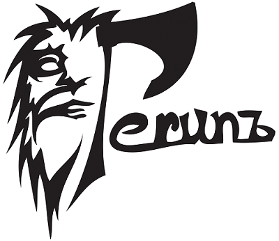
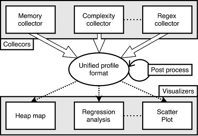
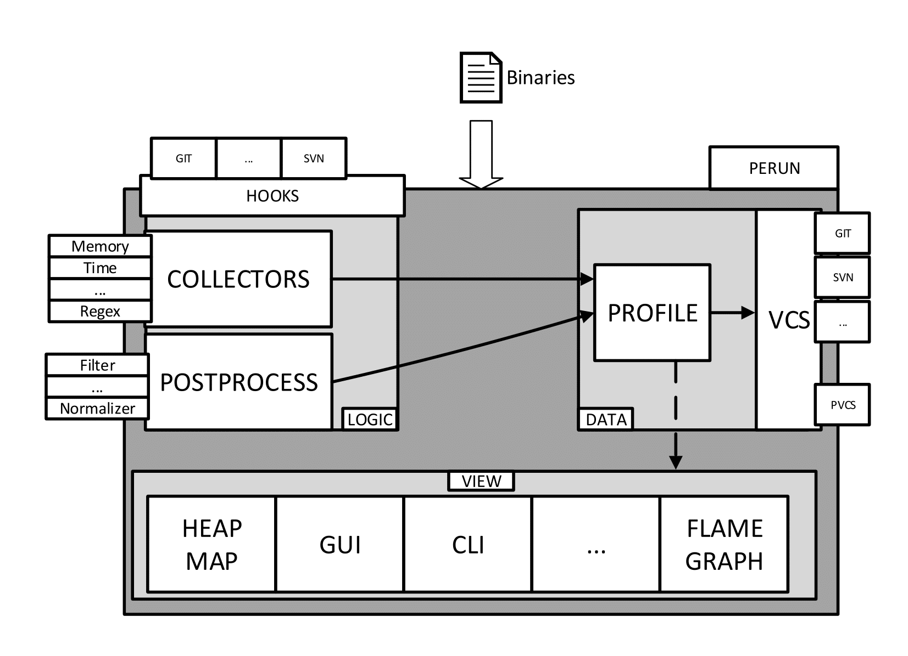

=================================================
  Perun: Lightweight Performance Control System
=================================================

Have you ever encountered a sudden performance degradation and could not figure out, when and
where the degradation was introduced?
Have you ever felt that you complete lost the control of the performance of your application?
Do you think that you have no idea whether the overall performance of your application is getting
better or not over the time?

Then, have no fear!

Perun is an open source light-weight Performance Control System! It puts a leash on your performance
and keeps it under YOUR control. Revision (or version) control systems track how your code base is
changing, what features were added and keeps a snapshots of version of projects. And actually you
can run all of the performance tests manually and then use VCS to store the actual profiles for
each minor version of your project, however, you are forced to do all of the profiling, annotations
with tag etc. by yourself, otherwise you WILL LOSE the precise history of the performance
your application.

Perun addresses such limitations by fully taking control of the performance of your applications.
In particular, it adds:

  1. **Context**---each profile is assigned to concrete minor version adding the missing context to
     your profiles---what was changed in the code base, when it was changed and who made the changes.
  2. **Automation**---perun can add hooks to your version control system to make sure you never miss
     to generate new profiles for each new minor or major version of your project. Morever, inspired
     by continuous integration systems, it easily lets you build the matrix of the jobs meant to run
     for each minor version.
  3. **Timeline**---perun preservers the history of your project, and lets you see, how the
     performance of your project changed during the time.

Lifetime of a profile
=====================

Profiles are defined in an unified format based on JSON format. Once profiles are generated,
the profile files are compressed and stored in the perun directory structure, and are assigned to
the current context of the project---current head minor version of the project.

Profiles are generated by the set of supported collectors (like e.g. memory collector, time collector
suited for complexity analysis, or collector driven by regular expressions) and can be further
enhanced and transformed by sequence of postprocessing sets (like e.g. filters, normalizers, etc.).

Such profiles then can be visualized by the set of visualization techniques like e.g. flame graphs,
heap maps, various scatter plots, etc.

Perun architecture
==================

Perun is divided into three main parts---view, data and logic---similarly to the model-view-control
design. Data contains a core unit of the Perun---the profile and the wrapper over the existing
version control system. The logic is in charge of automatization, manipulations and generation
of the profiles---it consists of set of collectors for generation of the profiles, set of postprocessors
for transformation of profiles and hooks to version control systems and other external units to
achieve automatization. The view is an independent module, which contains various visualization
techniques and wrappers for graphical and command line interface.

